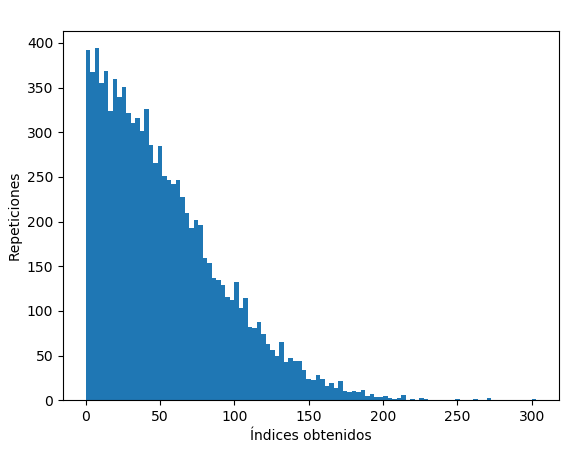
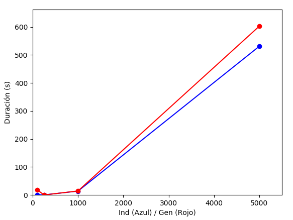
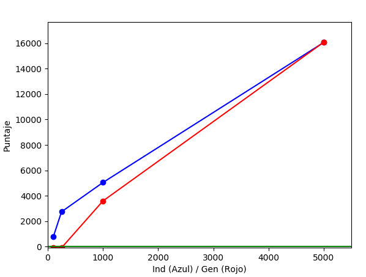

Informe de resultados
===

Algoritmo A*
---

### Objetivo

Encontrar zanahorias en un tablero con dimensiones de 25x25. Dónde al algoritmo se le envía por parámetro el campo de visión y la cantidad de zanahorias que debe encontrar. El objetivo es que el conejo tome la ruta más conveniente para tomar la mayor cantidad de zanahorias al menor costo, para ello se considerará únicamente lo que el conejo tiene en el campo de visión en ese momento. Es importante mencionar que el conejo únicamente tendrá 4 posibles lugares posibles a dónde moverse, los cuales son: izquierda, derecha, arriba, abajo.


### Función de costo
La función de costo de este algoritmo y de cada uno de los 4 posibles lugares donde el conejo se
puede mover está dada por: `f(n) = g(n) + h(n)`

Donde:
- `F(n)`: Costo total de moverse a alguna casilla en específico, ya sea arriba, abajo,
izquierda o derecha
- `G(n)`: Acumulado hasta un punto específico en la ejecución del algoritmo será
simplemente la cantidad de pasos. Se comenzará en 0 en la primera corrida, luego irá
aumentando en 1 cada vez.
- `H(n)`: Función heurística, la cuál se explicará a continuación.


### Función Heurística – h(n)
La función heurística es calculada únicamente respecto al rango de visión del conejo antes de moverse. Además, para hacer el movimiento del conejo un poco más inteligente y que tome el camino dónde hay más zanahorias en lugar zanahorias solitarias se utiliza una técnica de dividir el tablero en 2 partes dependiendo a dónde se podría mover el conejo. Por ejemplo, si se está calculando la función de costo del lado arriba del conejo, entonces a partir de ese punto hacía más arriba (hasta dónde alcance la visión), se dividirá el tablero en 2 partes, se cuenta la diferencia de zanahorias de la parte hacia dónde se movería el conejo respecto a todo el tablero, y a ese número se le suma la cantidad de pasos de la zanahoria más cercana en ese lugar respecto al conejo. Y luego, se le suma `g(n)`, que en la primera corrida es 0, y luego aumentaría respecto a los pasos que da el conejo. De manera similar, si se quisiera calcular el lado izquierdo del conejo, pero el tablero se dividirá en lado derecho e izquierdo.


Por ejemplo, se tiene el siguiente tablero.


El cuál representa únicamente la visión de 2 del conejo en un tablero de 25x25

Supongamos que queremos calcular la función de costo del lado arriba del conejo.


Entonces, se divide el tablero en 2, suponiendo que el conejo estuviera en el espacio que se está calculando.


Respecto a ese posible punto dónde el conejo podría moverse, se tiene que la zanahoria más cercana está a 2 pasos de distancia (cada paso es un 1). De ahí se obtiene el primer dato de la función heurística, el cual llamaremos ZanahoriaCerca = 2.


Luego, contamos la diferencia de zanahorias del cuadrante a dónde se movería el conejo, respecto al tablero completo.


Se puede ver que el total de zanahorias es de 5. Y la cantidad de zanahorias que están en el cuadrante a dónde se movería el conejo es de 3. Así, 5 – 3 = 2. Cuyo dato llamaremos diferenciaZanahorias = 2


Entonces hacemos la suma de ambos datos, y dará como resultado el `h(n)`.
```
H(n) = ZanahoriaCerca + diferenciaZanahorias
```

O bien,
```
H(n) = 2 + 2
```

Así volviendo a la función original donde se tiene que
```
F(n) = g(n) + h(n)
F(n) = 0 + 4
F(n) = 4
```


Así, 4 sería el costo de mover el conejo a la casilla de arriba, tal y cómo muestra el programa.
Es importante mencionar que, si 2 o más lados tienen el mismo costo, este se elegirá de manera
aleatoria.


### Análisis de variación de costos
A continuación, se va a observar cómo cambia el costo dependiendo las zanahorias en el posible
lugar al que el conejo se moverá, y dependiendo de la visión que tiene el conejo en ese momento.
Para eso utilizaremos el siguiente tablero, de dimensiones 25x25 y una visión de 10.

---

#### Vision de 10, Zanahorias 15

##### Tablero Total

##### Tablero Visible

##### Costos

##### Análisis
En la corrida anterior, al conejo se le asigno una cantidad de zanahorias por comer de 3. Como se puede observar en los costos, fueron cambiando según caminaba el conejo. Además el conejo pasó por la zanahoria más cercana y luego decidió ir hacia abajo por la cantidad de zanahorias quehay en dicho lugar. Lo que le permitiría completar de manera más rápida las zanahorias solicitadas.

---

#### Visión 5, Zanahorias 12

A continuación se hará un análisis con 3 zanahorias por comer, se verá la corrida hasta el final y el tablero visible final.

##### Tablero original

##### Tablero visible
Cantidad de zanahorias a comer = 3

##### Costos

##### Análisis
Como se puede observar, el conejo tiene a la izquierda 2 zanahorias cercanas. En el primer paso parece que irá por ellas, sin embargo elige ese lado ya que a la izquierda tiene más peso debido al heurístico, que al dividir el tablero en 2 se da cuenta que hay más zanahorias del lado izquierdo. Luego el conejo se da cuenta que arriba hay más con las cuales completar las más rápido las zanahorias a comer y decide ir hasta arriba a comer el conjunto de zanahorias.

---

#### Visión de 10, Zanahorias 81.

##### Tablero original

##### Tablero visible
Cantidad de zanahorias a comer = 3

##### Costos

##### Análisis
Como se puede observar, el conejo incluso conociendo que, en el primer movimiento, en la
dirección de abajo tiene una zanahoria más cerca, este detecta que en la parte superior hay un
conjunto más grande de zanahorias, lo cuál le permitirían completar la cantidad que necesita en
una menor cantidad de pasos.


Algoritmo Genético
---

### Objetivo

Al igual que con el algoritmo A*, este algoritmo recibirá como entrada un tablero con un conejo y una cantidad N de zanahorias.

El algoritmo se deberá encargar de encontrar un camino que dirija al conejo a comerse todas las zanahorias de la manera más eficiente posible, indicado por flechas en el tablero, que no interfieran con las zanahorias existentes.

Al efectuar una búsqueda, el conejo iniciará su camino en una dirección en particular, con las opciones limitadas a arriba, abajo, izquierda y derecha. Este seguirá en una sola dirección hasta que se le indique lo contrario o este se caiga del tablero, condenado a una trágica y dolorosa muerte por aplastamiento.

Una solución eficiente, será determinada por la función heurística de costo que incluye el algoritmo.

### Algoritmo genético

Un algoritmo genético provee un proceso de búsqueda de soluciones que se puede describir con el siguiente pseudocódigo:

```
poblacion <-- generarPoblacion(n)
for generaciones < num:
	for individuo in poblacion:
		// Dar un valor numerico al individuo
		individuo.puntaje <-- fitness(individuo)
	poblacion <-- sort(poblacion)
	while i < poblacion.lenght:
		nuevaPoblacion += cruce(padre1, padre2)
	poblacion = nuevaPoblacion
```

### Función heurística

Cada individuo es un tablero con las mismas dimensiones que el problema inicial, pero con cero o más flechas colocadas alrededor del mismo. La función de puntuación de cada uno se basa en la cantida de flechas que este individuo tenga, los pasos que requiere para solucionar el problema o llegar a un estado incontinuable (el conejo se cae); la cantidad de zanahorias restantes al aplicar al individuo al problema y finalmente si la solucion es efectiva o no.

Cada uno de estos rubros tiene un peso en unidades para sumar un total de puntos que calificará al individuo distribuido de la siguiente manera:

- +10.000 puntos si el individuo proporciona una solución correcta y 0 en caso contrario.
- -5 puntos por cada paso que de el conejo hasta terminar la ejecución.
- -100 puntos por cada flecha que contenga el tablero.
- +1000 puntos por cada zanahoria que haya consumido

Las zanahorias consumidas no se tienen en memoria, sino que se consulta calculando el total de zanahorias en el problema original y las zanahorias restantes al terminar la ejecución.


### Puntuación

Para efectuar la puntuación, se toma al individuo, se mezcla con el problema obteniendo un tablero que contiene flechas, zanahorias y al conejo y se ejecuta en la direccioń indicada. La función da un paso a la vez en la dirección actual, que se ve modificada por las flechas. Al dar un conejo un paso y caer en una flecha, este actualiza la dirección para el siguiente paso. Una vez que abandona la casilla de la flecha, inserta un espacio, por lo tanto las flechas son consumibles por lo que el conejo no puede caer en ningún tipo de ciclo infinito.

### Seleccion de padres

Una vez que se puntúa secuencialmente cada uno de los individuos, se ejecuta un ordenamiento por inserción, para colocar a los mejores individuos en las primeras posiciones del arreglo.

Luego se eligen 2 padres aleatoriamente, basados en la distribución de probabilidad normal. Los valores obtenidos serán los índices del arreglo de la población. La campana gaussiana estará centrada en cero, el inicio del arreglo de la población; se le aplica un valor absoluto para utilizar los valores negativos y se da una varianza de la tercera parte (1/3) del tamaño de la población. Así, en una población de 100 individuos, según la curva normal, se van a elegir con más probabilidad, los individuos con las puntuaciones en los lugares del 0 al ~30.

En la imagen se observa el comportamiento de la función gaussiana absoluta con la varianza correspondiente a una población de 200 individuos. El eje Y representa las repeticiones de un índice obtenido. Este ejemplo particular es con 10.000 elementos. En los casos que el índice supere la extensión de la población, se maneja con un módulo.



Esta selección sesga los resultados de los cruces. Si se cruzan individuos con una alta adaptabilidad, se puede llegar más rápidamente a una solución, sin embargo con menos generaciones se acerca a la solución pero se dejan de lado otros caminos promisorios. Este problema se ataca de una manera diferente más adelante.

### Cruce

El cruce es una acción que consiste en tomar los afortunados padres y obtener un nuevo individuo. Cada individuo se compone de una cantidad arbitraria de filas y columnas. El cruce consiste en tomar cada individuo de `n` filas, seleccionar un valor aleatorio `a`, tomar las filas previas al índice `a` de un individuo y unirlase con las filas posteriores al índice `a` del otro individuo.

```
, , ,v, , \                    , , , , ,    ===>   , , ,v, ,
, , , ,<,  \                   , ,>, ,v,    ===>   , , , ,<,
, ,A, , ,   ---Indice 2---     , , , , ,    ===>   , ,A, , ,
, ,<, ,>,                 \    , , , , ,v   ===>   , , , , ,v
, , , , ,                  \   , , , , ,    ===>   , , , , ,
, , , , ,                   \  ,<, ,<, ,    ===>   ,<, ,<, ,
, , ,A, ,                    \ , ,A, , ,<   ===>   , ,A, , ,<

```

El valor `a` puede ser desde `] 0, n-1 [` para evitar cruces inefectivos.

### Mutación

La mutación consiste en una modificación a un individuo sin ninguna razón aparente al aparecr un cruce. Estas mutaciones puedenn venir a mejorar o empobrecer la raza de tal manera de que un hijo sea mejor y sustituto de su padre o por el contrario inservible.

Al algoritmo de mutación es sencillo: Según una función de probabilida, determina si el individuo será mutado 0, 1, 2 o hasta 3 veces. Esta función se efectúa calculando un número uniformemente aleatorio entre 0 y 1800 y luego se clasifica en cada uno de los botes con los siguientes pesos:

```
- 0    - 49   : 2.7%    : Mutación 3 veces
- 50   - 299  : 13.8%   : Mutación 2 veces
- 300  - 999  : 38.8    : Mutación 1 vez
- 1000 - 1799 : 44.4%   : Sin mutación
```

Una vez determinado si se va a efectuar alguna mutación, se eligen 2 valores uniformemente aleatorios para utilizarse como fila y columna que sufrirá la mutación y se coloca una pieza aleatoria en ese espacio, dentro de las opciones de arriba, abajo, izquierda, derecha o vacío. De esta manera por medio de mutaciones se puede purgar el tablero de flechas innecesarias conforme pasen las generaciones.

### Selección de nueva generación

Una vez definidos estos procesos se detalla el criterio de selección para la siguiente generación.

Este consiste en generar la nueva población según 3 factores: Individuos más aptos persistentes, cruces y nuevos individuos.

#### Individuos más aptos persistentes

Como la población está ordenada en este punto, es fácil de seleccionar a los individuos más aptos, que consiste en tomar los primeros individuos de la población hasta completar un 5% de la totalidad de los mismos y se agregan a la nueva generacion.

#### Cruces

Luego del 5% inicial, se ejecutan cruces hasta satisfacer el total de 60% de individuos derivados de sus padres y se agregan a la nueva generación.

#### Nuevos individuos

Para completar el 35% restante de individuos para tener una nueva generación de la misma extensión que la pasada, se crean individuos nuevos en blanco para buscar nuevas y frescas soluciones al problema.

---

### Pruebas de rendimiento

Se efectuaron algunas pruebas de rendimiento para el algoritmo genético, que evalúan la velocidad y correctitud de corridas con distintos valores de generaciones e individuos.

En la primera imagen se puede comparar la duración del algoritmo según el parámetro que se varíe.

El gráfico azul, representa la duración del algoritmo con 100, 250, 1000 y 5000 individuos, con una cantidad constante de generaciones del 5% de cada uno de estos valores; 5, 13, 50 y 250.

El gráfico rojo representa la duración del algoritmo con 100, 250, 1000 y 5000 generaciones, con una cantidad constante de individuos, del 5% de cada uno de estos valores; 5, 13, 50 y 250.



En la segunda imagen se puede apreciar el puntaje obtenido por cada una de las corridas anteriores con los mismos valores propuestos. Note cómo con una población razonablemente grande o con una cantidad de generaciones razonablemente grande, se obtienen individuos muy aptos. Sin embargo, con muchos individuos y pocas generaciones (azul), se aproxima más rápidamente al individuo más apto, como es contrario para pocos individuos y muchas generaciones (rojo).



La linea verde inferior, grafica el cero. Esto señala que el puntaje para el gráfico rojo ni siquiera supera el cero para estas situaciones, lo cual significaría para el conejo que se mejor no ejecutar movimientos pues no va a obtener ningún resultado favorable con el individuo más apto de esta corrida.
